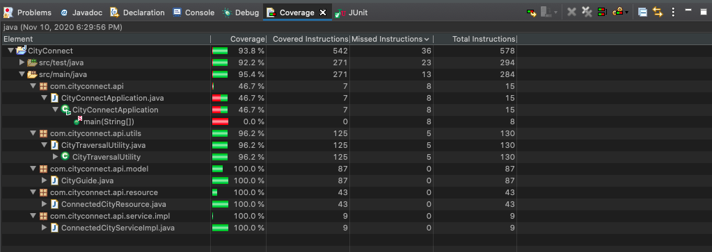

## MC Code Challenge


## Introduction
This document outlines the details as well as best practices in developing spring boot based REST API application which determines if two cities are connected based on origin and destination user inputs. This project also includes 

> 1. *Swagger API*
> 2. *JUnit* Test Cases
> 3. *100%* unit test coverage through Eclemma
> 4. *0 Sonar* Bugs, Vulnerabilities and Code smells
> 5. *Functional Test cases*
> 6. *Monitoring* metrics (API statistics)
> 7. Logging using logback
> 8. Exception hanling as per RESTful API
> 9. well documented, clean code

## SonarCloud Badges
[](https://sonarcloud.io/dashboard?id=reachtoauro_mc-coding-challenge)
[](https://sonarcloud.io/dashboard?id=reachtoauro_mc-coding-challenge)
[](https://sonarcloud.io/dashboard?id=reachtoauro_mc-coding-challenge)
[](https://sonarcloud.io/dashboard?id=reachtoauro_mc-coding-challenge)
[](https://sonarcloud.io/dashboard?id=reachtoauro_mc-coding-challenge)

## Prerequisites
Minimun requirements to run this project
> 1. *Java* 8 or above
> 2. *Maven* 
 
## Design Solution

> The solution is implemented using Graph data structure where each vertex represents a city, and each edge represents a connection between two cities.
> The graph is undirected as per one of the given examples where origin was Boston and destination Philadelphia
> Loading the given connected cities from the given file to crate a Graph using Adjacency Map
> Breadth First Traversal mechanism to identify if a path exists between two cities inside a Utility


## Implementation
This application is a *maven* project with implementations for below.

> 1. Spring Boot
> 2. Spring REST API
> 3. Swagger Specification
> 4. Unit test cases
> 5. Functional Test Cases
> 6. Actuator for health, info and monitoring metrics 
> 7. logback logging
> 8. Sonar Cloud Integration - https://sonarcloud.io/dashboard?id=reachtoauro_mc-coding-challenge

## Coding
> 1. The project is created using the Spring Initializer at https://start.spring.io, specifying a Maven Project using Java 8, Spring Boot version 2.3.5, and packaged as a JAR in Spring Tool Suite(STS)
> 2. Created a resource(controller) annotated with @RestController for Spring MVC.
> 3. For Logging I used logback(spring variation) and SLF4J(used as façade for commonly used logging frameworks in our case logback)
> 4. As per best practice, I placed the city.txt resource data file into the java resources folder, where we can read it using the ResourceLoaderAware implementation.

## Code coverage produced by eclemma plugin


## Installation & Run
  
 > To install and run goto the directory in which you want to install the project.
clone the github project via URL

```git
git clone https://github.com/reachtoauro/mc-coding-challenge.git
```
 > do  a maven clean install to build the source code
 
```maven
mvn clean install
```
> The UNIT testsuite can be executed separately by

```maven
mvn test
```

> Run the application using maven Spring Boot plugin
```maven
mvn spring-boot:run 
```
 
## API Testing
The API can be tested using an REST API testing tools such as POSTMAN, command line or browser

Browser URL:
```
http://localhost:8080/connected?origin=boston&destination=newark
```

For POSTMAN or Command line:
```
curl -X GET 'http://localhost:8080/connected?origin=Boston&destination=Albany'
```
## Swagger UI
```
http://localhost:8080/swagger-ui.html
```

## API monitoring/metrics


Health Check
```
http://localhost:8081/actuator/health
```

All available Actuator endpoints can be accessed here:
```
http://localhost:8081/actuator/
```

## Future Scope
> 1. Detailed ATDD test cases can be implemented using Cucumber and feature files
> 2. Usage of logback makes it easy to configure logs based on profiles
> 3. Also it can be leveraged to generate JSON logs which can be used for analytics purposes and using async logger features in logback
> 4. More logging profiles can be introduced
> 5. Authentication layer can be implemented using Spring Security or JWT
> 6. Performance Monitoring can be implemented using New Relic
> 7. The application can be easily dockerized and deployed in Elastic Beanstalk, ECS or leveraging EKS in AWS
> 8. Customized Error handling
